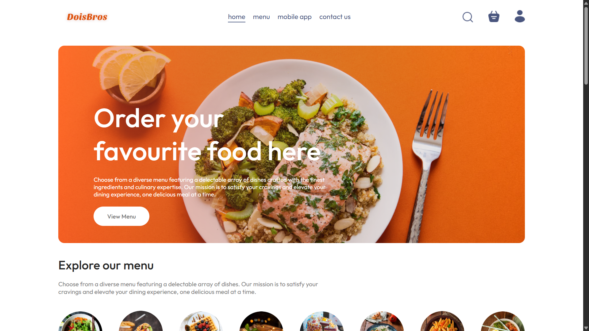
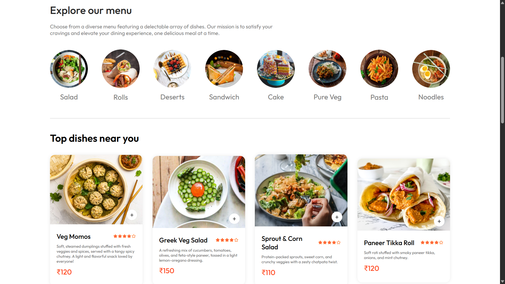
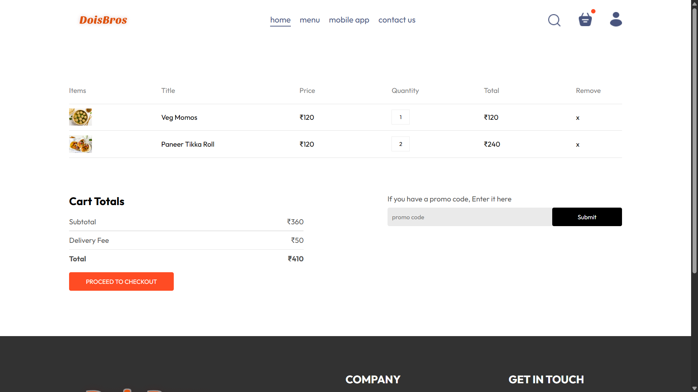
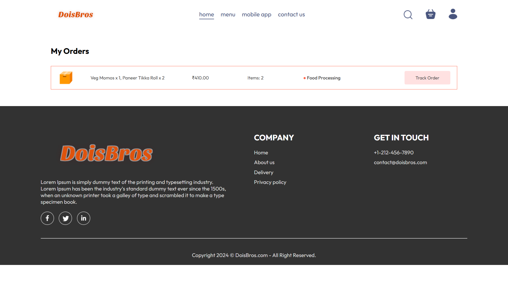
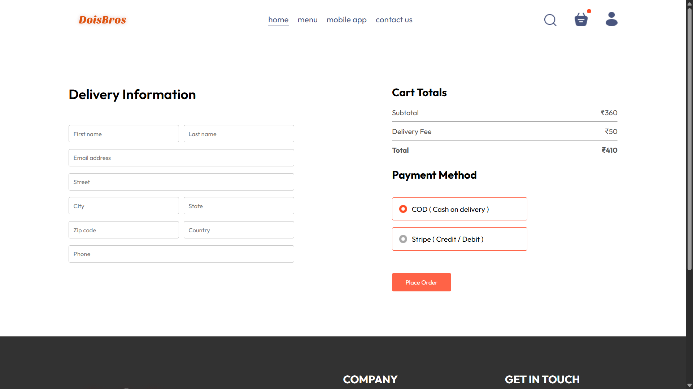
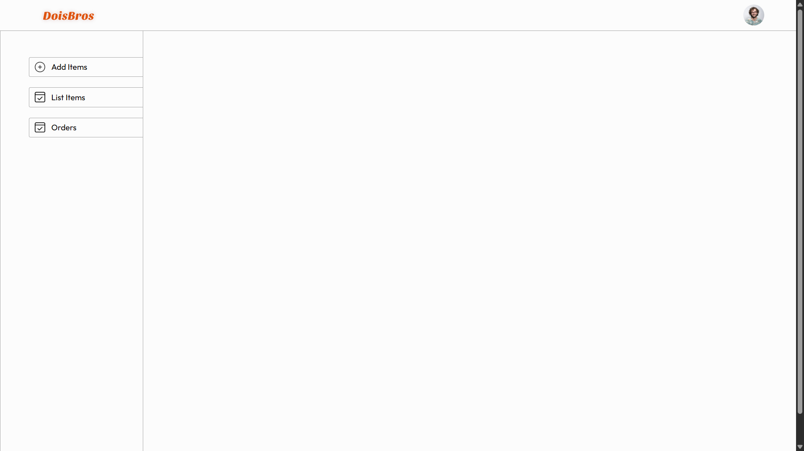
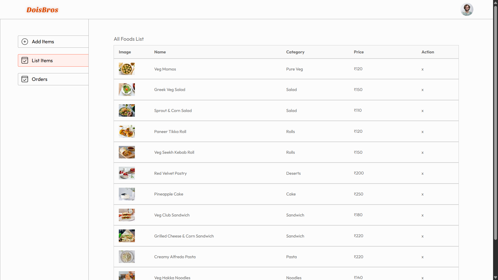
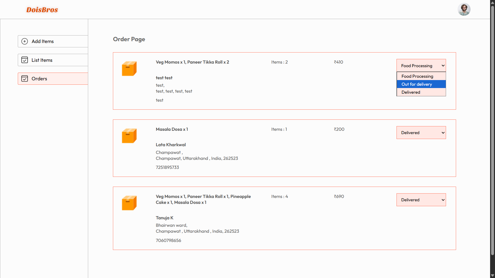

# 🍔 Dois Bros Café

**Dois Bros Café** is a **full-stack food ordering platform** where users can explore menus, add food items to their cart, place online orders, and make secure payments via **Stripe**.  
It also features an **admin panel** for managing menu items, tracking orders, and updating their statuses.

This project was built as part of **personal learning** and **full-stack MERN development**.  
I’m actively seeking **internship opportunities**, **collaborations**, and **open-source contributions**.

---

## 🚀 Live Demo

🔗 **Website:** [https://dois-bros-frontend.vercel.app](https://dois-bros-frontend.vercel.app)

---

## 🔧 Tech Stack

### 🔹 Frontend:
- **React.js** (Vite)
- **TailwindCSS**
- **React Router**
- **Axios**

### 🔹 Backend:
- **Node.js**
- **Express.js**
- **MongoDB** (with Mongoose)
- **RESTful APIs**

### 🔹 Other Tools & Services:
- **Stripe** – Payment Gateway Integration  
- **Cloudinary** – Image Uploads  
- **Postman** – API Testing  
- **MongoDB Atlas** – Cloud Database  

---

## 📦 Features

### 🛒 User Features:
- Browse food items with images, names, and prices.  
- Add/remove items from the shopping cart.  
- Secure **online payments** with **Stripe**.  
- Track **order status** in real time.  
- Fully **responsive design** for mobile and desktop.  

### 🛠️ Admin Panel:
- Add, update, and delete menu items.  
- Manage customer orders and update their statuses.  
- Dashboard for tracking total orders, payments, and menu items.  

---

## 🌟 Upcoming Features
- 🔍 **Search functionality** for food items  
- 📦 **Order history** & downloadable **invoices**  
- 🗺️ **Location-based delivery system**  
- 🔐 **JWT authentication** & **Google login**  

---

## 📸 Screenshots

### 🏠 Home



### 🛒 Shopping & Orders




### ⚙️ Admin Panel




---

## 🛠️ Getting Started

### 1️⃣ Clone the Repository
```bash
git clone https://github.com/UjjwalKharkwal/dois-bros
cd dois-bros

2️⃣ Backend Setup
cd backend
npm install

➕ Environment Variables

Create a .env file inside /backend and add:

MONGO_URI=your_mongo_connection_string
PORT=4000
STRIPE_SECRET_KEY=your_stripe_secret
CLOUDINARY_CLOUD_NAME=your_cloud_name
CLOUDINARY_API_KEY=your_api_key
CLOUDINARY_API_SECRET=your_api_secret
JWT_SECRET=your_jwt_secret


Start Backend:

npm run dev

3️⃣ Frontend Setup
cd frontend
npm install
npm run dev

🤝 Looking to Collaborate

I'm currently working solo and open to:

Internship roles 🧑‍💻

Open-source contribution opportunities 🌐

Project collaborations 🤝

📫 Contact

Email: tomailujjwalkharkwal@gmail.com

LinkedIn: linkedin.com/in/ujjwalkharkwal

GitHub: github.com/UjjwalKharkwal

⭐ Don’t forget to star this repo if you like it!
